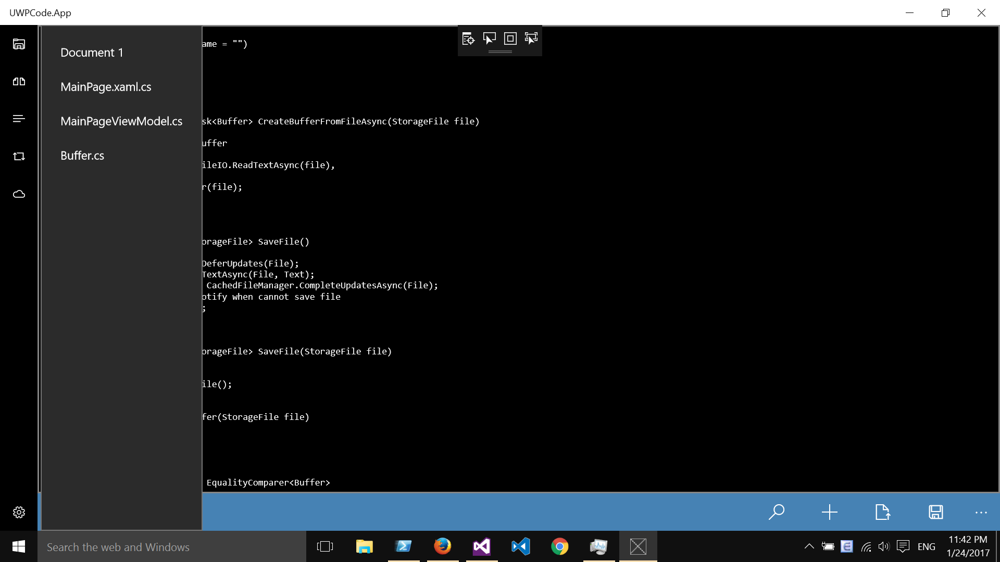

# UWP Code - A touch-based code editor for Windows 10 UWP
Tuan Tran

## Introduction

UWP is a code editor created from the ground up for the UWP platform, aiming to be an editor for quick and easy code manipulation for Windows 10 tablet device.

The editor takes inspiration from the Code Writer editor for Windows tablet as well as Sublime Text and Visual Studio Code. In a way this is an experiment for me to explore mobile development and building programming tool.

In creating this editor, we made a few decision on its design:
- The editor mainly aims at tablet user. At the early stage you will not find code targeting Windows Mobile user as: 1) We are not sure about Microsoft plan for the platform and 2) Nobody loves coding/reading code on a phone anyway
- The editor focuses on touch, instead of being mouse/keyboard-based as most traditional editor.
- The editor focuses on viewing/reading code instead of editing as most editor. This is due to both the limitation of the UWP API, the way people often use a touch device (who wants to type a source file with soft keyboard?), and the limitation of time.
- The editor should provide a clean & clutter free UI, blending in with the Microsoft Design Language.

## Goals

For the upcoming weeks, the project focuses on the basis of a code editor:
- Notepad-like ability: Open, create & save files. Cut, copy, paste; undo, redo; search & replace. Able to keep multiple files open at once
- Syntax-highlighting for at least one language & at least two color themes. Right now we are looking at implementing the tm-theme and tm-language specification.
- Code editor specific functions: Split screen, word wrap, code folding, comment & uncomment, indenting, line numbers. 
- A simple setting page to change font, tab styles, themes, language of current file, etc...

### Far-fetch ideas
- File tree & Function list
- Simple auto-complete
- Better method for text-selection
- Sync settings
- Sync files to cloud services/ GitHub
- A git client
- SFTP, SCP, etc...
Not that I expect to be able to touch any of these.

## Building
To build UWPCode, you need Windows 10 and above and Visual Studio 2015 and above, along with Windows 10 SDK. Please notice that the designer does not work on WIndows 10 1507.

Open your Visual Studio and clone the repo. Try running it to get a feel. The interface is easy enough and I don't think we need much introduction here. Please notice that many features are incomplete (including syntax highlighting, code folding, indenting, etc... Yea it's just a glorified Notepad for now).

### Code structure
The project makes use of Template10 and the MVVM framework. Code structure is really simple for now, as there are few features added to the editor.